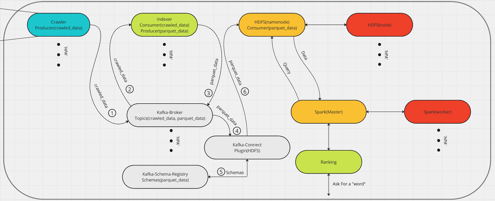
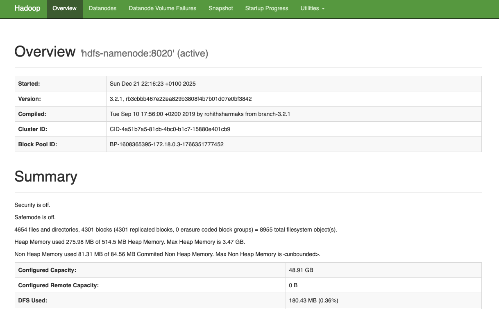
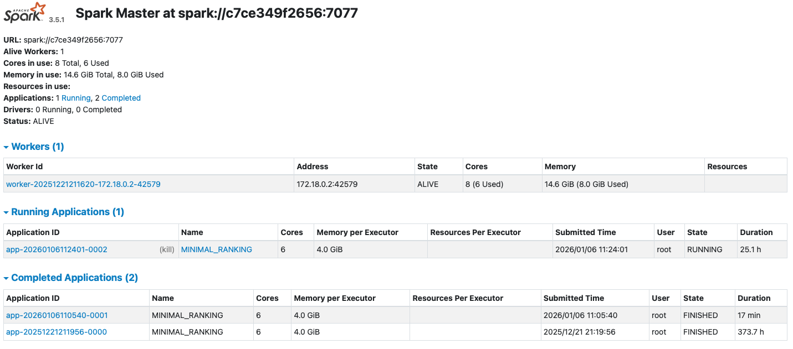

# 🔍 Aether

A **modular and scalable search engine** built to process, index, and rank web data using modern Big Data technologies.

---

## 🧩 Architecture Overview

This project is structured into **four main modules**:

### 1. 🕷️ Crawling
Collects raw web data from multiple sources concurrently, storing it for later processing.

### 2. 🧠 Indexing
Tags and structures the collected content, converting it to **Avro** format for efficient storage and compatibility with distributed systems.

### 3. ⚙️ Ranking
Computes document relevance through algorithms based on **content and link analysis**, preparing optimized data for search queries.

### 4. 🔎 Searching
Processes user queries and retrieves **ranked results** based on computed relevance scores.

---

## ⚡ Tech Stack

| Component | Purpose |
|------------|----------|
| **HDFS**   | Distributed storage system for raw and processed data |
| **Kafka**  | Real-time data ingestion and communication between modules |
| **Spark**  | Distributed data processing and indexing engine |

---

## 🏗️ System Flow

Below is the full system architecture and data flow diagram:

  

---

## 🚀 Features

- Distributed crawling and indexing
- Data serialization using **Avro**
- Scalable and fault-tolerant architecture
- Modular design for experimentation and extension
- Compatible with large-scale web data pipelines

---

## 🧪 Getting Started

1. Clone the repository:
   ```bash
   git clone https://github.com/Marioxuloh/Aether.git
   cd Aether

2. Launch System:
   ```bash
   docker compose up -d

## 🖥️ Interface

- Aether: port 5050

  

- HDFS: port 9870

  

- Spark: port 8080

  

- Ranking API: port 8000 with postman collection in /docs
